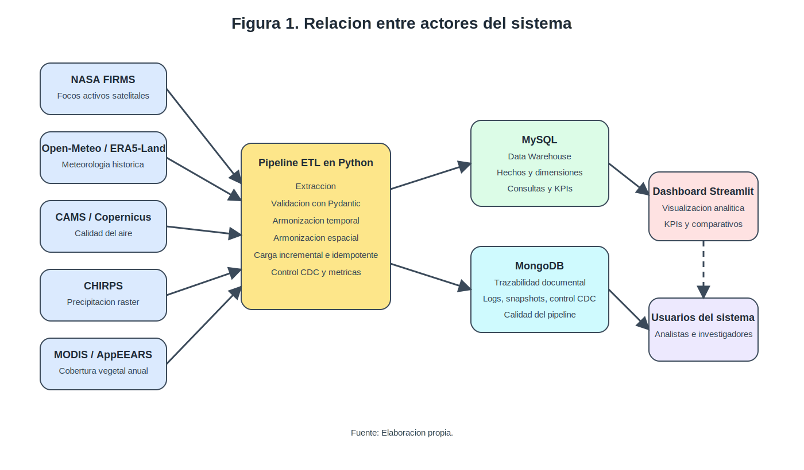
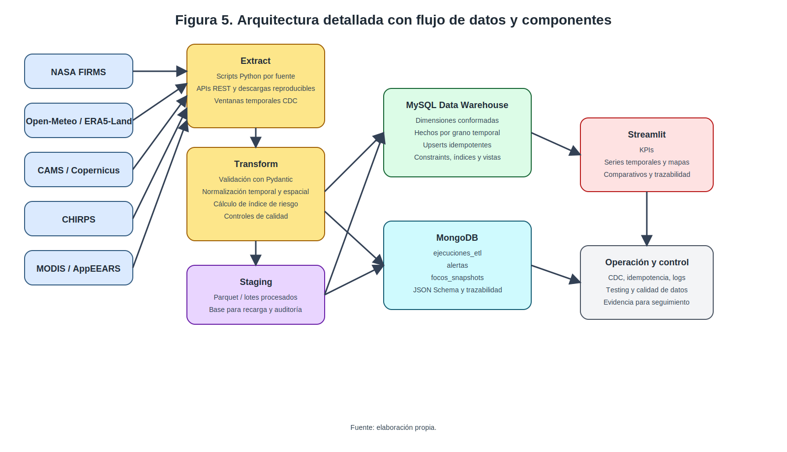

# Proyecto Final EC1 + EC2

**Título del proyecto:** Sistema integrado de datos ambientales para el análisis de incendios forestales, condiciones meteorológicas, precipitación, calidad del aire y cobertura vegetal en Uruguay y países limítrofes (Brasil y Argentina), período 2018-2025

**Carrera:** Licenciatura en Ingeniería de Datos e Inteligencia Artificial
**Curso:** Proyecto de Ingeniería de Datos
**Estudiante/s:** [Completar]  
**Docente:** [Completar]  
**Fecha:** [Completar]

## Resumen

El proyecto diseñó una solución integral de ingeniería de datos para analizar incendios forestales en Uruguay y sus países limítrofes (Brasil y Argentina) durante el período 2018-2025, mediante la integración de cinco fuentes abiertas y heterogéneas: NASA FIRMS, Open-Meteo / ERA5-Land, CAMS / Copernicus, CHIRPS y MODIS Land Cover a través de AppEEARS. El alcance regional se acota a estos tres países porque concentran los focos de calor que producen humo transfronterizo sobre territorio uruguayo y permiten un análisis comparativo manejable, preservando al mismo tiempo el carácter regional del estudio. El problema abordado fue la ausencia de un sistema unificado capaz de combinar datos con diferentes formatos, granularidades temporales, resoluciones espaciales y modelos conceptuales. Metodológicamente, se adoptó un enfoque de ingeniería aplicada e incremental, alineado con los entregables EC1 y EC2, que contempló análisis del dominio, exploración preliminar real de fuentes, diseño de arquitectura multicapa, modelado relacional tipo Data Warehouse en MySQL, modelado documental en MongoDB y diseño detallado de un pipeline ETL en Python con validación, CDC e idempotencia. Como resultado, se definió un modelo de destino integrado con dimensiones conformadas y hechos separados por granularidad, junto con reglas de integridad, esquemas JSON para trazabilidad documental, KPIs y lineamientos de visualización en Streamlit. El diseño permite responder consultas analíticas verificables, preservar histórico, registrar el comportamiento del pipeline y sentar la base para la implementación reproducible del sistema en la etapa siguiente.

**Palabras clave:** incendios forestales; ingeniería de datos; ETL; CDC; MySQL; MongoDB; calidad del aire; cobertura vegetal.

## 1. Introducción

Los incendios forestales constituyen un fenómeno ambiental complejo cuya ocurrencia e intensidad dependen de la interacción entre clima, disponibilidad de combustible, dinámica hidrológica y características del territorio. Jolly et al. (2015) mostraron que la duración de las temporadas de peligro de incendio se ha incrementado de forma significativa a escala global, mientras que Reid et al. (2016) documentaron que la exposición al humo de incendios se asocia con incrementos de material particulado fino y con efectos respiratorios adversos. En consecuencia, estudiar incendios forestales en Uruguay y su entorno regional inmediato (Brasil y Argentina) exige una aproximación integrada que combine focos activos, variables meteorológicas, precipitación, calidad del aire y cobertura vegetal dentro de una misma estructura de análisis.

En esta región, la principal dificultad no radica en la falta de datos, sino en su dispersión entre plataformas con formatos y escalas diferentes. NASA FIRMS distribuye focos activos detectados por sensores satelitales; Open-Meteo ofrece acceso programático a datos meteorológicos históricos; CAMS publica información atmosférica y de calidad del aire; CHIRPS provee precipitación de base satelital; y AppEEARS facilita el acceso a productos MODIS de cobertura terrestre. Estas diferencias impiden el cruce directo entre datasets y convierten el problema en un caso genuino de ingeniería de datos, porque se requiere un sistema capaz de extraer, transformar, armonizar y almacenar información heterogénea en un modelo de destino coherente.

Desde la perspectiva metodológica del curso, el proyecto se encuadra como una solución de ingeniería aplicada y no como un trabajo de investigación teórica pura. La consigna exige integrar fuentes heterogéneas, aplicar transformaciones controladas, mantener trazabilidad, incorporar actualización incremental y soportar consultas analíticas verificables. Por lo tanto, el propósito del proyecto no es solo reunir datos, sino construir una solución técnica que gestione el ciclo de vida completo del dato, desde la ingestión hasta el análisis.

### Figura 1. Diagrama de relación entre actores

Fuente: elaboración propia.

### 1.1 Problema

El problema específico abordado en este proyecto es la ausencia de un sistema unificado que permita analizar incendios forestales en Uruguay y sus países limítrofes (Brasil y Argentina) mediante la integración simultánea de focos de calor, condiciones meteorológicas, precipitación, calidad del aire y cobertura vegetal. Aunque cada una de estas dimensiones dispone de fuentes públicas técnicamente accesibles, esas fuentes presentan diferencias sustanciales en formato, granularidad temporal, resolución espacial y estructura conceptual. Giglio et al. (2016) describen productos de detección activa de fuego con granularidad por evento, mientras que la documentación de Open-Meteo presenta series diarias y horarias, y Muñoz-Sabater et al. (2021) caracterizan ERA5-Land como un reanálisis orientado a aplicaciones terrestres. Esa heterogeneidad impide el cruce directo entre datasets y exige una etapa formal de armonización.

El problema, en consecuencia, no es únicamente ambiental, sino también arquitectónico y metodológico. Para responder preguntas sobre evolución temporal, comparación regional o relación entre variables de distintas fuentes, se necesita un sistema capaz de transformar estructuras existentes en un modelo integrado de destino, con preservación del histórico, trazabilidad de cambios y soporte para consultas agregadas. Esta necesidad coincide con la lógica de EC1 y EC2, donde se exige transformar una temática general en un problema técnico delimitado y luego diseñar una solución que combine modelo relacional, modelo NoSQL, ETL, integridad y métricas.

### 1.2 Objetivos

#### 1.2.1 Objetivo general

Diseñar e implementar conceptualmente un sistema integrado de datos ambientales que consolide información de incendios forestales, condiciones meteorológicas, precipitación, calidad del aire y cobertura vegetal en Uruguay y sus países limítrofes (Brasil y Argentina) durante el período 2018-2025, utilizando MySQL como repositorio relacional analítico y MongoDB como repositorio documental de trazabilidad, de modo que el sistema sea capaz de responder consultas agregadas, preservar histórico y registrar el comportamiento del pipeline mediante mecanismos formales de validación y actualización incremental.

#### 1.2.2 Objetivos específicos

1. Diseñar un pipeline ETL en Python capaz de extraer, transformar y cargar datos de cinco fuentes heterogéneas mediante procesos reproducibles e idempotentes, utilizando validación estructural previa y controles de integridad en la carga.
2. Construir un modelo dimensional en MySQL con tablas de hechos y dimensiones conformadas, orientado a consultas analíticas, análisis temporal y cálculo de KPIs.
3. Implementar conceptualmente un mecanismo de CDC basado en ventana temporal retrospectiva y verificación por hash de lote, de manera que el sistema detecte tanto registros nuevos como correcciones históricas.
4. Diseñar un modelo documental en MongoDB para almacenar logs de ejecución, metadatos de control, snapshots y métricas de calidad del pipeline, utilizando validación mediante JSON Schema.
5. Definir KPIs alineados con las preguntas analíticas del proyecto y con la futura capa de visualización, manteniendo correspondencia explícita entre preguntas, consultas, resultados y representaciones gráficas.
6. Documentar reglas de integridad, trade-offs técnicos, riesgos y limitaciones para asegurar que la solución sea justificable, auditable y escalable.

### 1.3 Alcance del proyecto

El proyecto integra cinco fuentes abiertas y heterogéneas: NASA FIRMS para incendios activos, Open-Meteo / ERA5-Land para meteorología, CAMS / Copernicus para calidad del aire, CHIRPS para precipitación y MODIS Land Cover / AppEEARS para cobertura vegetal. La combinación de fuentes ofrece cobertura suficiente para el período objetivo 2018-2025 y justifica la integración multifuente del proyecto.

El alcance espacial corresponde a tres países: Uruguay como núcleo del sistema y sus dos limítrofes, Brasil y Argentina. El alcance temporal se mantiene en el período 2018-2025. La selección se fundamenta en criterios técnicos: los focos detectados en el sur de Brasil (Rio Grande do Sul, Mato Grosso) y en el norte argentino (Misiones, Salta) generan el humo transfronterizo que afecta directamente la calidad del aire y la visibilidad sobre territorio uruguayo, mientras que la inclusión de los tres países simultáneamente permite responder las preguntas comparativas del EC1 sin diluir el foco en Uruguay. El sistema queda diseñado para escalar el alcance a otros países sudamericanos mediante un cambio de configuración en `PAISES_SA`, sin modificaciones estructurales en el modelo. El análisis se apoya en una grilla espacial común de 0,25° para asegurar interoperabilidad entre fuentes con resoluciones distintas. Quedan fuera del alcance el modelado predictivo, el análisis sanitario de poblaciones afectadas, la evaluación económica de incendios y la incorporación de fuentes cuyo acceso no sea programático o reproducible.

### 1.4 Limitaciones

Una limitación importante del proyecto deriva de la cobertura desigual entre fuentes. Mientras FIRMS y Open-Meteo permiten trabajar con granularidad de evento, diaria u horaria, CHIRPS opera con productos mensuales y MODIS con productos anuales. Esto obliga a construir hechos separados por nivel temporal y a evitar cruces ingenuos entre datasets.

También deben considerarse las limitaciones de calidad de ciertas variables, especialmente cuando existen nulos masivos, latencia de publicación o revisiones históricas posteriores. Por esa razón, el diseño del sistema incorpora métricas de calidad, control incremental, reglas de integridad y trazabilidad documental.

## 2. Marco conceptual

El concepto de ETL es central en este trabajo porque la solución depende de una secuencia ordenada de extracción, transformación y carga sobre fuentes con estructuras muy diferentes. Python se adopta como lenguaje de implementación del pipeline por su ecosistema maduro para manipulación de datos, validación y conexión con distintos motores de persistencia. En particular, Pydantic permite validar tipos, rangos y estructuras antes de la inserción, mientras que Streamlit ofrece una base adecuada para construir aplicaciones analíticas de forma rápida y reproducible.

El concepto de Data Warehouse también es fundamental. En este proyecto, el repositorio relacional no se define como una copia de las fuentes, sino como un modelo integrado de destino diseñado para histórico, agregación y cálculo de indicadores. Por ello, el diseño en MySQL se orienta a hechos y dimensiones conformadas, priorizando rendimiento de consulta y preservación de histórico frente a una normalización transaccional estricta.

En paralelo, el proyecto incorpora persistencia políglota. La parte estructurada e intensiva en joins se asigna a MySQL, mientras que la parte documental y semiestructurada se asigna a MongoDB. Esto permite separar claramente las consultas analíticas del almacenamiento de logs, snapshots, alertas y metadatos de control.

El concepto de CDC ocupa un lugar metodológico clave en esta arquitectura. El mecanismo incremental debe contemplar no solo inserción de registros nuevos, sino también modificaciones sobre datos existentes. En coherencia con esa exigencia, el proyecto plantea un CDC basado en ventana temporal retrospectiva y verificación de hash por lote, registrando metadatos en MongoDB para permitir auditoría y control incremental. La idempotencia complementa ese diseño: reejecutar el pipeline sobre un mismo lote no debe generar duplicados ni inconsistencias.

La calidad de datos se evalúa sobre cuatro dimensiones: completitud, unicidad, consistencia y validez. Estas métricas no se tratan como una revisión secundaria, sino como una condición para que las preguntas analíticas puedan responderse con fiabilidad. Finalmente, los KPIs cumplen el rol de traducir preguntas del dominio en métricas trazables y verificables sobre el modelo de destino.

El concepto de SLA (Service Level Agreement) se incorpora al diseño como un conjunto de compromisos operativos que el sistema debe cumplir para que las preguntas analíticas y los KPIs tengan valor en producción. En el contexto de SINIA-UY no se trata de un acuerdo contractual externo, sino de umbrales internos que delimitan la operación esperada del pipeline: frescura máxima de los datos respecto al evento real (por ejemplo, focos NRT con latencia inferior a seis horas), disponibilidad mínima de la base relacional durante la ventana operativa diurna en que se consulta el dashboard, tiempo máximo de respuesta para las consultas de la capa Streamlit y porcentaje mínimo de tests de calidad superados antes de exponer datos al usuario final. Estos umbrales transforman el rendimiento del sistema en una propiedad medible y permiten distinguir entre una operación nominal y una operación degradada que requiera intervención.

El concepto de despliegue híbrido refiere a la coexistencia planificada de componentes que viven en entornos distintos pero operan como un sistema único. En SINIA-UY el despliegue es híbrido en dos sentidos complementarios. Por un lado, hay una separación entre el ambiente de desarrollo local del equipo (PostgreSQL y MongoDB nativos en la PC del estudiante) y el ambiente del servidor académico de UTEC (base `grp03db` asignada en `10.200.245.40` para Postgres y Mongo), donde el código se prueba localmente y se promueve mediante Git a la instancia remota. Por otro lado, dentro del propio sistema conviven dos motores complementarios: un motor relacional para el Data Warehouse y un motor documental para trazabilidad operativa, conectados por el mismo pipeline Python y consumidos por la misma capa Streamlit. Este enfoque permite aislar fallos por motor, escalar cada pieza con políticas distintas y mantener el desarrollo independiente del ambiente productivo sin sacrificar la coherencia funcional del sistema.

### Cuadro 1. Principales artículos revisados y su aporte al proyecto

| Fuente | Tipo | Aporte principal al proyecto |
|---|---|---|
| Jolly et al. (2015) | Artículo científico | Fundamenta la relevancia del aumento del peligro global de incendios y justifica el análisis temporal del riesgo. |
| Reid et al. (2016) | Revisión crítica | Sustenta la inclusión de PM2.5 y PM10 como dimensión de impacto atmosférico asociada a incendios. |
| Giglio et al. (2016) | Artículo científico | Describe el algoritmo de detección activa de fuego MODIS/FIRMS y respalda el uso de FRP, brightness y confidence. |
| Muñoz-Sabater et al. (2021) | Artículo científico | Justifica el uso de ERA5-Land / Open-Meteo como base meteorológica coherente para aplicaciones terrestres. |
| van der Werf et al. (2017) | Artículo científico | Aporta contexto sobre emisiones de fuego y la necesidad de análisis multifuente a escala regional. |
| Documentación Open-Meteo | Documentación técnica | Define acceso programático, variables horarias/diarias y parámetros de consulta reproducibles. |
| Documentación MySQL | Documentación técnica | Respalda la elección del motor relacional, índices, constraints y diseño analítico. |
| Documentación MongoDB | Documentación técnica | Fundamenta validación JSON Schema, documentos flexibles, replicación y modelado NoSQL. |
| Documentación Pydantic | Documentación técnica | Soporta validación de estructuras y tipos en la fase de transformación y pre-carga. |
| Documentación Streamlit | Documentación técnica | Justifica la futura capa analítica y la exposición de KPIs y visualizaciones. |

Fuente: elaboración propia con base en bibliografía científica y documentación técnica oficial.

## 3. Metodología

### 3.1 Tipo de investigación

El proyecto se desarrolla bajo un enfoque de ingeniería aplicada e incremental. La primera etapa se orienta al análisis del dominio, el problema, las fuentes, la exploración preliminar, la calidad y la arquitectura inicial. La segunda etapa se centra en el diseño del modelo integrado de destino, el mapeo fuente-destino, la resolución de conflictos de integración, el modelo relacional, el modelo NoSQL, la arquitectura detallada, el ETL y las métricas.

### 3.2 Contexto del proyecto

La arquitectura propuesta incluye fuentes externas, ingesta en Python, staging, transformación, persistencia relacional en MySQL, persistencia documental en MongoDB y futura visualización en Streamlit. La solución se apoya en componentes separables y trazables, de modo que cada etapa del ciclo de vida del dato pueda ser auditada.

### 3.3 Instrumentos de recolección de datos

Las fuentes utilizadas incluyen APIs REST, descargas reproducibles de archivos geoespaciales y servicios abiertos de datos históricos. Para cada una se releva nombre, enlace oficial, tipo de acceso, formato, frecuencia, volumen, granularidad, variables relevantes y limitaciones técnicas. La exploración preliminar efectiva se apoyó en scripts de extracción y transformación desarrollados en Python para cada fuente.

### Tabla 1. Actores del sistema y sus relaciones

| Actor | Rol en el sistema | Relación principal |
|---|---|---|
| NASA FIRMS | Proveedor de focos de calor activos | Alimenta hechos diarios de incendios y snapshots documentales |
| Open-Meteo / ERA5-Land | Proveedor de meteorología histórica y pronóstico | Alimenta hechos diarios meteorológicos y cálculo del índice de riesgo |
| CAMS / Copernicus | Proveedor de calidad del aire | Alimenta hechos diarios de PM10, PM2.5 y AQI |
| CHIRPS | Proveedor de precipitación satelital | Alimenta hechos mensuales de precipitación y anomalía hídrica |
| AppEEARS / MODIS | Proveedor de cobertura vegetal | Alimenta hechos anuales de cobertura y transición |
| Pipeline ETL en Python | Orquestador técnico | Extrae, valida, transforma, integra y carga |
| MySQL | Repositorio relacional analítico | Resuelve consultas, agregaciones y KPIs |
| MongoDB | Repositorio documental de trazabilidad | Registra logs, snapshots, alertas y metadatos de control |
| Dashboard Streamlit | Capa analítica | Consume datos consolidados y expone KPIs y visualizaciones |
| Usuario analítico | Consumidor de resultados | Formula preguntas y valida salidas del sistema |

Fuente: elaboración propia.

### Tabla 2. Variables relevantes por dimensión analítica

| Dimensión | Variables principales | Propósito analítico | Fuente dominante |
|---|---|---|---|
| Incendios | latitud, longitud, fecha, hora, FRP, confidence, brightness | Medir ocurrencia, intensidad y distribución espacial de focos | NASA FIRMS |
| Meteorología | temperatura máxima, mínima, humedad relativa, viento, precipitación diaria, ET0 | Explicar condiciones predisponentes del fuego | Open-Meteo / ERA5-Land |
| Calidad del aire | PM10, PM2.5, AQI, aerosol optical depth | Aproximar impacto atmosférico asociado a actividad de fuego | CAMS / Copernicus |
| Precipitación | precipitación mensual, anomalía porcentual | Caracterizar sequía, estrés hídrico y contexto hidrológico | CHIRPS |
| Cobertura vegetal | LC_Type1, descripción IGBP, grupo combustible | Relacionar incendios con tipo de cobertura y combustible potencial | MODIS / AppEEARS |
| Control ETL | estado, duración, registros procesados, insertados, actualizados, hash de lote | Medir trazabilidad, calidad e incrementalidad del pipeline | MongoDB / MySQL |

Fuente: elaboración propia.

### Tabla 3. Granularidad temporal y espacial por fuente

| Fuente | Granularidad temporal | Granularidad espacial | Formato principal | Implicancia de integración |
|---|---|---|---|---|
| NASA FIRMS | Evento / subdiaria | Coordenada puntual satelital | CSV / API | Requiere agregación diaria y asignación a grilla |
| Open-Meteo / ERA5-Land | Diaria y horaria | Grilla meteorológica / punto consultado | JSON / CSV | Requiere armonización por celda y día |
| CAMS / Copernicus | Horaria | Punto o grilla atmosférica | JSON / CSV | Requiere agregación diaria para comparabilidad |
| CHIRPS | Mensual para el proyecto | Raster / punto extraído | CSV / geoespacial | Requiere hecho mensual separado |
| MODIS / AppEEARS | Anual | Raster 500 m / punto extraído | CSV | Requiere hecho anual separado |

Fuente: elaboración propia.

### 3.4 Procedimientos de análisis de datos

El análisis del proyecto se organiza en etapas: extracción desde APIs y archivos, validación inicial, transformación temporal y espacial, control de calidad, carga en MySQL, carga documental en MongoDB y diseño de consultas analíticas y KPIs. Durante EC1 se realizó exploración preliminar real, incluyendo acceso efectivo a las fuentes, muestras, estructura de datos, nulos y problemas de integración. Durante EC2 se diseñó la solución de destino completa.

### 3.5 Aspectos éticos

El proyecto se construye sobre datos abiertos y no sensibles. Sin embargo, eso no elimina la necesidad de documentar sesgos, vacíos y límites estructurales del dato. La metodología, por tanto, incorpora métricas de calidad y registro explícito de acciones correctivas, evitando presentar resultados futuros como neutrales o completos por definición.

### 3.6 Preguntas analíticas del proyecto

1. ¿Cómo evolucionó la cantidad de incendios forestales en Uruguay, Brasil, Argentina y Chile entre 2018 y 2025?
2. ¿Qué países concentran la mayor cantidad de focos por año y por mes?
3. ¿En qué meses se registra mayor actividad de incendios y cómo cambia ese patrón entre países?
4. ¿Qué relación existe entre temperatura elevada, baja humedad y actividad de fuego?
5. ¿Cómo se comporta el índice de riesgo meteorológico frente a la ocurrencia real de focos?
6. ¿Cómo varían PM2.5 y PM10 durante períodos con alta actividad de incendios?
7. ¿Qué celdas o regiones presentan mayor recurrencia de incendios intensos?
8. ¿Qué relación existe entre déficit de precipitación y aumento de focos?
9. ¿Qué tipos de cobertura vegetal concentran más actividad de incendios?
10. ¿Cómo se vinculan las transiciones de cobertura vegetal con cambios en la distribución espacial del fuego?

## 4. Resultados — Diseño técnico del sistema integrado

### 4.1 Análisis detallado de fuentes y campos

NASA FIRMS constituye la fuente principal para incendios activos. Giglio et al. (2016) describen el algoritmo de detección MODIS Collection 6 y documentan mejoras en la detección y reducción de falsas alarmas. En términos analíticos, esto respalda el uso de variables como brightness, FRP y confidence dentro del proyecto.

Open-Meteo / ERA5-Land se incorpora como fuente meteorológica histórica. De acuerdo con la documentación oficial, el servicio histórico de Open-Meteo permite acceder a variables diarias y horarias como temperatura, humedad relativa, precipitación, viento y presión, mientras que Muñoz-Sabater et al. (2021) caracterizan ERA5-Land como un producto consistente para aplicaciones sobre superficie terrestre.

CAMS / Copernicus se incorpora para cubrir la dimensión de calidad del aire. Su valor analítico no radica solo en proveer PM2.5 y PM10, sino también en permitir aproximar el impacto del humo de incendios sobre la atmósfera. En esta línea, Reid et al. (2016) destacan el papel del PM2.5 como uno de los indicadores más relevantes en la literatura sobre humo de incendios.

CHIRPS aporta precipitación histórica y MODIS Land Cover, a través de AppEEARS, se utiliza para estudiar la relación entre incendios y cobertura vegetal. Ambas fuentes son necesarias para contextualizar los incendios dentro de un sistema ambiental más amplio.

### Tabla 4. Ficha técnica: NASA FIRMS

| Atributo | Descripción |
|---|---|
| Organismo | NASA / FIRMS |
| Tipo de acceso | API REST y descarga CSV |
| Cobertura temporal objetivo | 2018-2025 |
| Granularidad | Evento individual detectado |
| Variables relevantes | latitude, longitude, acq_date, acq_time, bright_ti4, bright_ti5, confidence, FRP, daynight |
| Formato | CSV |
| Problemas de integración | Duplicados por lotes, confianza en escala semántica, necesidad de agregación diaria |
| Uso en el modelo | Hecho diario de incendios y snapshots documentales |

Fuente: elaboración propia con base en Giglio et al. (2016) y documentación oficial de FIRMS.

### Tabla 5. Ficha técnica: Open-Meteo / ERA5-Land

| Atributo | Descripción |
|---|---|
| Organismo | Open-Meteo sobre ERA5-Land |
| Tipo de acceso | API REST |
| Cobertura temporal objetivo | 2018-2025 |
| Granularidad | Diaria y horaria según variable |
| Variables relevantes | temperature_2m_max, temperature_2m_min, relative_humidity_2m_min, wind_speed_10m_max, precipitation_sum, ET0 |
| Formato | JSON / CSV |
| Problemas de integración | Diferencias entre histórico y forecast, necesidad de normalización espacial y cálculo de índice compuesto |
| Uso en el modelo | Hecho diario meteorológico y cálculo de índice de riesgo |

Fuente: elaboración propia con base en Muñoz-Sabater et al. (2021) y documentación oficial de Open-Meteo.

### Tabla 6. Ficha técnica: CAMS / Copernicus

| Atributo | Descripción |
|---|---|
| Organismo | Copernicus Atmosphere Monitoring Service |
| Tipo de acceso | API vía Open-Meteo Air Quality |
| Cobertura temporal objetivo | 2018-2025 |
| Granularidad | Horaria, agregada a diaria en ETL |
| Variables relevantes | pm10, pm2_5, aerosol_optical_depth, dust, european_aqi |
| Formato | JSON / CSV |
| Problemas de integración | Nulos horarios, necesidad de agregación diaria, comparación con umbrales OMS |
| Uso en el modelo | Hecho diario de calidad del aire y alertas operativas |

Fuente: elaboración propia con base en documentación oficial de CAMS y Reid et al. (2016).

### Tabla 7. Ficha técnica: CHIRPS

| Atributo | Descripción |
|---|---|
| Organismo | UCSB / SERVIR / CHIRPS |
| Tipo de acceso | API ClimateSERV / descargas reproducibles |
| Cobertura temporal objetivo | 2018-2025 |
| Granularidad | Mensual para este proyecto |
| Variables relevantes | fecha, precipitación mensual acumulada, anomalía porcentual |
| Formato | CSV |
| Problemas de integración | Cambio de escala respecto de datos diarios, necesidad de hecho mensual separado |
| Uso en el modelo | Hecho mensual de precipitación y sequía relativa |

Fuente: elaboración propia con base en documentación oficial de CHIRPS.

### Tabla 8. Ficha técnica: MODIS Land Cover / AppEEARS

| Atributo | Descripción |
|---|---|
| Organismo | NASA MODIS / AppEEARS |
| Tipo de acceso | API AppEEARS |
| Cobertura temporal objetivo | 2018-2025 |
| Granularidad | Anual |
| Variables relevantes | LC_Type1, descripción IGBP, punto, año |
| Formato | CSV |
| Problemas de integración | Baja frecuencia temporal, cambio de escala frente a focos diarios |
| Uso en el modelo | Hecho anual de cobertura y transición de clase |

Fuente: elaboración propia con base en documentación oficial de AppEEARS y MODIS.

#### 4.1.1 Exploración preliminar real de las fuentes

La guía del proyecto exige que el análisis preliminar esté respaldado por evidencia real de acceso, estructura y problemas observados. Por esa razón, la exploración se apoyó en pruebas efectivas de descarga, consulta y revisión de columnas, tipos, nulos, duplicados e inconsistencias evidentes mediante scripts de extracción y transformación en Python.

Desde esta exploración surgen hallazgos relevantes para el diseño. En FIRMS, la presencia de niveles de confianza distintos exige normalización semántica o filtrado analítico. En CAMS, algunas variables atmosféricas presentan nulos suficientes como para comprometer su utilidad si no se tratan adecuadamente. En CHIRPS y MODIS, la diferencia de granularidad obliga a separar tablas de hechos y a evitar joins temporales directos sin agregación. Estas observaciones condicionan directamente el diseño del modelo integrado, el CDC y las reglas de calidad.

#### 4.1.2 Calidad preliminar de datos

La evaluación preliminar de calidad se apoya en cuatro dimensiones: completitud, unicidad, consistencia y validez. A diferencia de una descripción superficial del dataset, estas métricas permiten vincular problemas concretos del dato con el impacto real que tendrán sobre las preguntas analíticas del proyecto.

### Tabla 9. Evaluación de calidad por fuente

| Fuente | Completitud | Unicidad | Consistencia | Validez | Riesgo principal |
|---|---|---|---|---|---|
| NASA FIRMS | Alta en campos críticos | Requiere deduplicación por clave natural | Requiere asignación país/grilla | Coordenadas y FRP deben validarse | Duplicados y heterogeneidad de confidence |
| Open-Meteo | Alta en variables base | Unicidad por fecha, punto y tipo de dato | Requiere normalización de tipos y unidades | Índice de riesgo debe quedar en [0,1] | Mezcla de histórico y forecast |
| CAMS | Media-alta con nulos horarios parciales | Unicidad por fecha y punto tras agregación | Requiere agregación diaria | PM10 y PM2.5 no negativos | Nulos horarios y latencia |
| CHIRPS | Alta | Unicidad por punto y mes | Requiere coherencia temporal mensual | Precipitación no negativa | Cruce ingenuo con datos diarios |
| MODIS | Alta | Unicidad por punto y año | Requiere consistencia de clase IGBP | Dominio LC_Type1 acotado | Baja frecuencia temporal |

Fuente: elaboración propia.

### Tabla 10. Impacto de problemas de calidad en preguntas analíticas

| Problema de calidad | Fuente afectada | Pregunta analítica impactada | Mitigación propuesta |
|---|---|---|---|
| Duplicados por lote | FIRMS | Evolución temporal y ranking de días críticos | Clave natural + upsert idempotente |
| Nulos horarios | CAMS | Comparación de PM10/PM2.5 en días con fuego | Agregación diaria con horas válidas |
| Diferencia diario/mensual/anual | CHIRPS / MODIS | Relación entre precipitación, cobertura e incendios | Hechos separados por grano |
| Semántica variable de confidence | FIRMS | Intensidad y filtro de focos confiables | Mapeo semántico a escala numérica |
| Cambios históricos en origen | Todas | CDC y trazabilidad | Ventana retrospectiva + hash de lote |

Fuente: elaboración propia.

### 4.2 Diseño conceptual, lógico y físico

La guía de la etapa 2 insiste en que el modelo de destino no debe representar “el mundo desde cero”, sino integrar estructuras ya existentes en las fuentes. Esto implica que el diseño del modelo relacional debe partir del análisis de campos, de la identificación de conflictos de integración y del mapeo fuente-destino. El proyecto adopta exactamente ese enfoque, documentando primero los campos de origen y luego la correspondencia con hechos y dimensiones del modelo final.

El modelo se estructura como una estrella extendida con dimensiones conformadas y tablas de hechos separadas por granularidad temporal. Las dimensiones principales son tiempo, país, grilla espacial y cobertura vegetal, mientras que los hechos se dividen en incendios diarios, meteorología diaria, calidad del aire diaria, precipitación mensual y cobertura vegetal anual. Esta separación responde al principio de que las diferencias de granularidad no deben ocultarse ni forzarse a una única tabla si ello compromete consistencia o rendimiento.

### Tabla 11. Diseño lógico del modelo relacional

| Tipo | Entidad | Propósito |
|---|---|---|
| Dimensión | dim_tiempo | Unifica cortes diarios, mensuales y anuales |
| Dimensión | dim_pais | Permite comparación regional por país |
| Dimensión | dim_grilla | Resuelve integración espacial entre fuentes |
| Dimensión | dim_cobertura | Agrupa clases IGBP y combustible potencial |
| Hecho | fact_incendios_diario | Resume focos, FRP e intensidad por día y celda |
| Hecho | fact_meteorologia_diaria | Resume condiciones meteorológicas e índice de riesgo |
| Hecho | fact_calidad_aire_diaria | Resume PM10, PM2.5 y AQI por día y celda |
| Hecho | fact_precipitacion_mensual | Resume precipitación y anomalía por mes y celda |
| Hecho | fact_cobertura_vegetal_anual | Resume clase dominante por año y celda |

Fuente: elaboración propia.

### Tabla 12. Colecciones NoSQL y propósito

| Colección | Estructura dominante | Propósito |
|---|---|---|
| ejecuciones_etl | Documento de log con métricas flexibles | Trazabilidad del pipeline y CDC |
| alertas | Documento de evento semiestructurado | Registro de alertas operativas y severidad |
| focos_snapshots | Documento diario autocontenido con array embebido | Consulta del estado diario sin joins |

Fuente: elaboración propia.

### Tabla 13. Reglas de integridad por motor

| Motor | Mecanismo | Aplicación en el proyecto |
|---|---|---|
| MySQL | PK / FK | Integridad entre hechos y dimensiones |
| MySQL | CHECK / dominios | Rangos de riesgo, horas válidas, precipitación no negativa |
| MySQL | UNIQUE compuesta | Idempotencia por grano analítico |
| MongoDB | JSON Schema | Tipos, campos requeridos y dominios básicos |
| Python / Pydantic | Validación previa | Tipos, rangos, fechas y estructuras antes de cargar |

Fuente: elaboración propia.

### Tabla 14. Campos por fuente de datos

| Fuente | Campos clave | Observación |
|---|---|---|
| FIRMS | latitude, longitude, acq_date, acq_time, frp, confidence, daynight | Se convierten a foco agregado diario por grilla |
| Open-Meteo | fecha, temperature_2m_max, relative_humidity_2m_min, wind_speed_10m_max, precipitation_sum, et0_fao_evapotranspiration | Base del índice de riesgo |
| CAMS | fecha_hora, pm10, pm2_5, european_aqi, aerosol_optical_depth | Se agrega de horario a diario |
| CHIRPS | fecha, precipitacion_mm, punto, país | Se conserva a nivel mensual |
| MODIS | año, LC_Type1, descripción, punto | Se conserva a nivel anual |

Fuente: elaboración propia.

### Tabla 15. Mapeo fuente-destino

| Fuente | Campo origen | Transformación | Destino |
|---|---|---|---|
| FIRMS | acq_date | Agregación diaria | fact_incendios_diario.tiempo_key |
| FIRMS | latitude / longitude | Asignación a celda 0,25° | fact_incendios_diario.grilla_key |
| FIRMS | frp | Sum, avg, max por día-celda | fact_incendios_diario.frp_total_mw / frp_promedio_mw / frp_max_mw |
| FIRMS | confidence | Mapeo semántico y conteo | fact_incendios_diario.focos_confianza_alta |
| Open-Meteo | fecha | Mapeo a dimensión tiempo | fact_meteorologia_diaria.tiempo_key |
| Open-Meteo | temp, humedad, viento, ET0 | Normalización y ponderación | fact_meteorologia_diaria.indice_riesgo |
| CAMS | pm10, pm2_5 | Agregación diaria | fact_calidad_aire_diaria.pm10_media_ug_m3 / pm2_5_media_ug_m3 |
| CHIRPS | precipitacion_mm | Agregación mensual / anomalía | fact_precipitacion_mensual.precipitacion_total_mm / anomalia_pct |
| MODIS | LC_Type1 | Mapeo a dimensión cobertura | fact_cobertura_vegetal_anual.cobertura_key |

Fuente: elaboración propia.

### Tabla 16. Conflictos de integración y resolución

| Conflicto | Manifestación | Resolución de diseño |
|---|---|---|
| Granularidad temporal distinta | Evento vs día vs mes vs año | Separación en hechos por grano |
| Resolución espacial heterogénea | Punto, raster, coordenada puntual | Grilla común de 0,25° |
| Identificadores incompatibles | Algunas fuentes no comparten IDs territoriales | Derivación de claves espaciales y de país |
| Unidades y escalas distintas | PM10, FRP, precipitación, humedad | Normalización explícita y diccionario técnico |
| Correcciones históricas | Cambios en datos ya cargados | CDC con ventana retrospectiva + hash de lote |
| Nulos parciales | CAMS y variables complementarias | Métricas de completitud y exclusión controlada |

Fuente: elaboración propia.

### Figura 3. Diagrama ER/EER del modelo integrado de destino

Fuente: elaboración propia.

#### 4.2.1 Modelo relacional como Data Warehouse

El modelo relacional del proyecto cumple rol de Data Warehouse. Se diseña en coherencia con el rol analítico ya definido en la arquitectura preliminar y, por tanto, prioriza el rendimiento en consultas y la preservación del histórico. Esto implica que el modelo no se evalúa como un esquema OLTP tradicional, sino como un repositorio analítico diseñado para agregaciones, drill-down temporal y cálculo de KPIs.

En términos de normalización, las dimensiones cumplen una normalización controlada, mientras que el esquema global adopta una desnormalización justificada consistente con la lógica estrella. La separación por hechos evita forzar una sola tabla con granularidades incompatibles.

#### 4.2.2 Justificación del motor relacional y aclaración de implementación

La elección del motor relacional responde a criterios de estabilidad, madurez, disponibilidad, soporte de índices, constraints y capacidad suficiente para un Data Warehouse de mediana escala. En el marco del proyecto, el motor relacional se utiliza para almacenar hechos y dimensiones, gestionar índices y sostener consultas agregadas que luego alimentarán KPIs y visualizaciones.

A nivel de diseño se elaboró el modelo dimensional canónico en MySQL 8 con motor InnoDB, claves sustitutas (`*_key`), dimensiones conformadas (`dim_tiempo`, `dim_pais`, `dim_grilla`, `dim_cobertura`) y tablas de hechos separadas por granularidad (`fact_incendios_diario`, `fact_meteorologia_diaria`, `fact_calidad_aire_diaria`, `fact_precipitacion_mensual`, `fact_cobertura_vegetal_anual`). Este modelo se presenta como referencia teórica y figura en el Anexo A.

A nivel de implementación operativa, sin embargo, el sistema funciona sobre PostgreSQL 16. La razón es estrictamente práctica: el servidor académico que UTEC asignó al grupo expone una instancia de PostgreSQL accesible vía red interna sobre la base `grp03db` (puerto 15434), mientras que no se proporcionó instancia de MySQL en el mismo entorno. PostgreSQL es funcionalmente equivalente al modelo lógico planteado: soporta los mismos constraints, índices parciales, vistas materializadas y tipos numéricos exactos necesarios, además de incorporar el motor de replicación nativo (streaming replication) discutido en la sección 4.3.6. La traducción entre el DDL MySQL del Anexo A y el DDL PostgreSQL operativo (`sql/ddl/02_schema.sql` del repositorio) es directa: cambian palabras clave concretas (`AUTO_INCREMENT` → `SERIAL`, `ENGINE=InnoDB` desaparece, `ENUM` se reemplaza por `CHECK (col IN (...))`) pero el grano analítico, las claves naturales y las restricciones de dominio se preservan sin pérdida. Esta dualidad ilustra una propiedad importante del diseño: el modelo lógico se mantiene válido frente a cambios de motor cuando se respetan los principios de hechos por granularidad e idempotencia.

### Figura 4. Esquema estrella del Data Warehouse

Fuente: elaboración propia.

**DDL del modelo relacional:** ver [Anexo A](ANEXO_A_DDL_MYSQL.md).

### 4.3 Arquitectura, ETL, integridad y métricas

#### 4.3.1 Arquitectura detallada

La arquitectura propuesta se organiza en capas: fuentes, ingesta, staging, transformación, persistencia relacional, persistencia documental y capa analítica. Python actúa como la tubería del sistema, orquestando extracción, limpieza, transformación, carga y automatización básica. A partir de allí, MySQL se reserva para el modelo estructurado del Data Warehouse y MongoDB para trazabilidad, snapshots, control de CDC y métricas de calidad.

La capa analítica se implementará con Streamlit, orientada a presentar KPIs, gráficos temporales, comparaciones espaciales y trazabilidad del pipeline en una interfaz accesible.

### Figura 5. Arquitectura detallada con flujo de datos y componentes

Fuente: elaboración propia.

#### 4.3.2 Diseño detallado del ETL

El ETL se diseña como un conjunto de pipelines por fuente, coordinados bajo una secuencia común: verificación de CDC, extracción, validación, transformación, carga y registro. No se presenta aquí como una “caja negra”, sino como el puente formal entre los modelos fuente y el modelo de destino.

1. **Extract.** Cada fuente dispone de un extractor específico. FIRMS, Open-Meteo, CAMS, CHIRPS y AppEEARS se consultan mediante API o descarga reproducible.
2. **Validate.** Los registros se validan con modelos estructurales y controles de rango.  
3. **Transform.** Se normalizan tipos, fechas, unidades, dominios y niveles de granularidad. Se calcula el índice de riesgo meteorológico a partir de temperatura, humedad, viento y sequía relativa.
4. **Load relacional.** Se aplican upserts o inserciones controladas por clave compuesta en MySQL.  
5. **Load documental.** Se registran logs, alertas y snapshots diarios en MongoDB.  
6. **Audit.** Cada corrida registra métricas de volumen, estado, duración y ventana procesada.

#### 4.3.2.1 CDC

El mecanismo de Change Data Capture combina dos estrategias. La primera es una ventana temporal retrospectiva, que permite recuperar datos nuevos o publicados con retraso. La segunda es una verificación de hash por lote, almacenada en MongoDB, que permite detectar correcciones históricas en rangos ya procesados. En el prototipo del repositorio ya se implementa un control incremental por watermark; el diseño final del informe amplía ese enfoque con verificación por hash para cubrir modificaciones históricas.

#### 4.3.2.2 Idempotencia

Los procesos de carga se diseñan bajo el principio de idempotencia, de modo que una reejecución del pipeline no produzca duplicados ni inconsistencias. En este proyecto, esa propiedad se sostiene mediante claves compuestas en las tablas de hechos, operaciones de upsert en la capa relacional y control de lotes en la capa documental. Así, el CDC y la idempotencia funcionan como mecanismos complementarios.

#### 4.3.3 Reglas de integridad SQL y NoSQL

Las reglas de integridad del sistema se diseñan en tres niveles. Primero, Python y Pydantic validan estructuras y restricciones antes de la carga. Segundo, MySQL impone claves primarias, claves foráneas, unicidad y restricciones de dominio sobre hechos y dimensiones. Tercero, MongoDB aplica validación estructural con JSON Schema sobre documentos de control, calidad y trazabilidad.

**JSON Schema de las colecciones MongoDB:** ver [Anexo B](ANEXO_B_JSON_SCHEMA_MONGODB.md).

#### 4.3.4 KPIs del sistema

Los KPIs del sistema se derivan directamente de las preguntas analíticas formuladas en EC1. Deben estar alineados con los objetivos del proyecto, con el modelo de destino y con futuras visualizaciones.

### Tabla 17. KPIs del sistema

| KPI | Descripción | Consulta base | Pregunta asociada | Visualización sugerida |
|---|---|---|---|---|
| Densidad de focos por país y mes | Total de focos agregados por país / mes | Vista `vw_focos_por_pais_mes` | 1, 2, 3 | Serie temporal comparativa |
| FRP máximo mensual | Máxima potencia radiativa observada por mes | Hecho de incendios diario agregado | 1, 2 | Línea + barras |
| Índice de riesgo promedio por país | Media mensual de índice de riesgo | Vista `vw_riesgo_por_pais_mes` | 4, 5 | Línea comparativa |
| Días críticos | Conteo de días con riesgo alto o muy alto | Hecho meteorológico diario | 4, 5 | Heatmap calendario |
| PM10 en condiciones de quema | Comparación de PM10 con y sin actividad de focos | Hecho calidad del aire + incendios | 6 | Boxplot / dispersión |
| Anomalía de precipitación | Déficit o exceso respecto a base histórica | Hecho precipitación mensual | 8 | Barra divergente |
| Cobertura dominante y combustibilidad | Clase IGBP dominante por celda / año | Hecho cobertura vegetal anual | 9, 10 | Mapa categórico |
| Frescura del pipeline | Diferencia entre fecha de datos y fecha de carga | MongoDB `ejecuciones_etl` | Control operativo | Tarjeta KPI |
| Tasa de registros válidos | Registros válidos / procesados por lote | MongoDB `ejecuciones_etl` | Calidad de pipeline | Gauge o barra |

Fuente: elaboración propia.

#### 4.3.5 Trade-offs técnicos documentados

El proyecto documenta sus decisiones como trade-offs y no como elecciones neutras. Adoptar una grilla de 0,25° facilita la integración y simplifica los joins, pero sacrifica resolución espacial. Elegir MySQL reduce complejidad operativa y aprovecha una plataforma madura, aunque implica menor especialización analítica que algunos motores column-oriented. Usar MongoDB para trazabilidad evita forzar documentos variables a un esquema rígido, pero añade el costo de administrar un segundo motor.

### Tabla 18. Trade-offs técnicos documentados

| Decisión | Ventaja | Costo / riesgo asumido |
|---|---|---|
| Grilla espacial 0,25° | Interoperabilidad entre fuentes | Pérdida de resolución respecto al dato original |
| Hechos separados por granularidad | Evita cruces inválidos | Mayor complejidad de diseño |
| MySQL como DW | Simplicidad, madurez, índices, constraints | Menor especialización OLAP que motores dedicados |
| MongoDB para trazabilidad | Flexibilidad documental y snapshots autocontenidos | Operación de un segundo motor |
| CDC por ventana + hash | Cubre inserciones y correcciones históricas | Requiere metadatos adicionales |
| Streamlit como capa analítica | Rapidez de desarrollo | Menor control fino que una capa web a medida |

Fuente: elaboración propia.

#### 4.3.6 Replicación

El diseño contempla replicación en ambos motores como mecanismo de continuidad operativa ante fallos de un nodo. En EC2 se trata de una decisión de arquitectura: se define qué tecnología se utilizará, cuántos nodos se prevén y cómo se garantiza la continuidad del servicio, sin todavía configurar la infraestructura.

Para PostgreSQL se adopta replicación asíncrona en streaming con un nodo primario y dos réplicas de solo lectura. El primario recibe todas las escrituras del ETL y propaga los registros WAL (write-ahead log) hacia las réplicas en tiempo casi real. La elección de un esquema 1 primario + 2 réplicas obedece a tres consideraciones: el quórum mínimo necesario para detectar particiones de red sin perder disponibilidad, el balance entre costo de almacenamiento y tolerancia a fallos, y la posibilidad de dirigir las consultas de la capa Streamlit y de los KPIs a una réplica sin afectar el rendimiento de las cargas del ETL. La continuidad del servicio se asegura mediante un proceso de promoción manual o automatizada de una réplica a primario en caso de caída del nodo principal, y por el hecho de que el dashboard puede continuar respondiendo consultas analíticas sobre la otra réplica durante el procedimiento. Para el modo asíncrono se acepta explícitamente una ventana de pérdida potencial de los últimos segundos de escritura, lo cual es admisible para un Data Warehouse cuya verdad última son las fuentes externas y cuyo ETL puede reprocesar el último lote por idempotencia (sección 4.3.2.2).

Para MongoDB se adopta el patrón canónico de réplica set con tres miembros: un primario, un secundario y un árbitro (o, alternativamente, tres miembros con datos completos cuando el almacenamiento lo permita). El primario absorbe escrituras del ETL (logs, snapshots, alertas) y los secundarios replican el oplog continuamente. Ante caída del primario, los miembros que retengan quórum eligen un nuevo primario automáticamente en pocos segundos sin intervención manual. La cantidad mínima de tres nodos obedece a que MongoDB requiere mayoría para elegir primario; con dos nodos una partición de red dejaría al cluster sin escritura. Esta arquitectura encaja bien con el rol operacional de MongoDB en el sistema, porque los logs y snapshots requieren alta disponibilidad de escritura aunque la latencia por elección durante una caída sea aceptable.

A nivel de arquitectura, la replicación implica que cada motor pasa de ser un punto único de falla a un cluster de pequeña escala. La arquitectura detallada (Figura 5) se complementa entonces con un nodo primario y al menos un nodo réplica por motor, conectados por la red interna de UTEC, y con el ETL Python apuntando siempre al primario para escritura y, opcionalmente, a una réplica para lecturas analíticas pesadas.

#### 4.3.7 Sharding

El sharding se incorpora al diseño como una previsión de escalabilidad para los conjuntos de datos de mayor volumen, y no como una decisión activa en el alcance académico actual. La razón es que el volumen actual del proyecto (~20 millones de focos FIRMS y decenas de miles de registros meteorológicos para tres países) cabe holgadamente en un único nodo PostgreSQL y un único primario MongoDB. Sin embargo, la consigna pide identificar dónde y cómo se aplicaría sharding si el sistema se escalara a un alcance mayor (por ejemplo, todo Sudamérica o todo el continente), y esa previsión se documenta a continuación.

En PostgreSQL, la tabla candidata es `focos_calor` porque concentra el volumen dominante del Data Warehouse y porque sus consultas analíticas se hacen casi siempre con filtros temporales. Se elige `fecha_adq` como shard key con estrategia de particionamiento por rango mensual o trimestral. La justificación técnica es que esta clave presenta alta cardinalidad (un valor distinto por día), distribuye los datos de forma equilibrada entre shards y se alinea con el patrón de consulta dominante de los KPIs (densidad de focos por mes, comparativa interanual, evolución temporal), lo cual permite que el planificador haga pruning de shards y consulte únicamente las particiones temporales relevantes. El impacto previsto es positivo en consultas que filtran por rangos de fecha cortos y neutro a leve en consultas que necesitan agregar toda la historia, donde el costo del scan distribuido se compensa con el paralelismo entre shards. Como contraparte, se acepta que las consultas por punto geográfico sin filtro temporal pueden requerir scatter-gather entre todos los shards; ese costo se acota con un índice secundario sobre `(latitud, longitud)` dentro de cada partición.

En MongoDB, la colección candidata es `focos_snapshots`, que embebe los focos detectados día a día por país. Se elige una shard key compuesta `{ fecha: 1, pais: "hashed" }` por dos razones combinadas. La primera, `fecha` ascendente, mantiene la coherencia temporal del oplog y permite consultas por ventana temporal sin scatter-gather. La segunda, `pais` con hashing, distribuye uniformemente los documentos entre shards para evitar el efecto "hot shard" típico de las claves crecientes puras (donde todas las escrituras recientes caerían en el último shard). El impacto en consultas es favorable cuando se filtra por rango de fechas y país, que es el patrón principal del dashboard. Las consultas que recorren toda la historia para un único país aún funcionan correctamente porque MongoDB enruta el query al subconjunto de shards que contienen el hash correspondiente. La colección `ejecuciones_etl`, en cambio, se mantiene sin sharding porque su volumen es bajo y su patrón de acceso es secuencial por fecha de ejecución.

Esta sección documenta entonces una arquitectura escalable: el sistema actual no requiere sharding por su tamaño, pero el modelo está diseñado de manera que activarlo cuando crezca el volumen sea un cambio operativo sobre las mismas tablas y colecciones, sin reescritura del ETL ni del modelo lógico.

## 5. Conclusiones

El proyecto define una solución de ingeniería de datos orientada a integrar incendios forestales, condiciones meteorológicas, precipitación, calidad del aire y cobertura vegetal en Uruguay y sus países limítrofes (Brasil y Argentina) durante 2018-2025. La etapa inicial permitió delimitar el problema, justificar su relevancia, analizar las fuentes y formular preguntas analíticas concretas. La etapa de diseño transformó ese planteo en una arquitectura técnica coherente, con modelo relacional de destino, modelo documental, ETL, CDC, reglas de integridad, métricas y criterios de continuidad y escalabilidad.

En términos tecnológicos, la solución combina MySQL como repositorio analítico estructurado y MongoDB como repositorio documental de trazabilidad, apoyándose en Python para la ingestión y transformación y en Streamlit para la futura capa de visualización. Las capacidades documentadas oficialmente por estas herramientas respaldan su uso dentro de la arquitectura propuesta, mientras que la literatura científica consultada fundamenta la selección de variables y la necesidad de un análisis multifuente del fenómeno.

La principal fortaleza del diseño es la correspondencia explícita entre preguntas del dominio, fuentes seleccionadas, transformaciones ETL, modelo de destino y KPIs. La principal limitación, por su parte, es que la heterogeneidad temporal y espacial de las fuentes obliga a asumir una estrategia de armonización que simplifica parte de la variabilidad original. No obstante, esa decisión es metodológicamente justificable dentro del alcance del proyecto.

La siguiente etapa consistirá en implementar esta arquitectura con datos reales completos del período 2018-2025, medir rendimiento, comprobar idempotencia y CDC, recalcular métricas de calidad y demostrar la correspondencia entre preguntas, consultas, visualizaciones y resultados mediante evidencia de ejecución y testing.

## Referencias bibliográficas

Giglio, L., Schroeder, W., & Justice, C. O. (2016). *The collection 6 MODIS active fire detection algorithm and fire products*. Remote Sensing of Environment, 178, 31-41. https://doi.org/10.1016/j.rse.2016.02.054

Jolly, W. M., Cochrane, M. A., Freeborn, P. H., Holden, Z. A., Brown, T. J., Williamson, G. J., & Bowman, D. M. J. S. (2015). *Climate-induced variations in global wildfire danger from 1979 to 2013*. Nature Communications, 6, 7537. https://doi.org/10.1038/ncomms8537

Muñoz-Sabater, J., Dutra, E., Agustí-Panareda, A., Albergel, C., Arduini, G., Balsamo, G., Boussetta, S., Choulga, M., Harrigan, S., Hersbach, H., Martens, B., Miralles, D. G., Piles, M., Rodríguez-Fernández, N. J., Zsoter, E., Buontempo, C., & Thépaut, J.-N. (2021). *ERA5-Land: A state-of-the-art global reanalysis dataset for land applications*. Earth System Science Data, 13(9), 4349-4383. https://doi.org/10.5194/essd-13-4349-2021

Reid, C. E., Brauer, M., Johnston, F. H., Jerrett, M., Balmes, J. R., & Elliott, C. T. (2016). *Critical review of health impacts of wildfire smoke exposure*. Environmental Health Perspectives, 124(9), 1334-1343. https://doi.org/10.1289/ehp.1409277

van der Werf, G. R., Randerson, J. T., Giglio, L., van Leeuwen, T. T., Chen, Y., Rogers, B. M., Mu, M., van Marle, M. J. E., Morton, D. C., Collatz, G. J., Yokelson, R. J., & Kasibhatla, P. S. (2017). *Global fire emissions estimates during 1997-2016*. Earth System Science Data, 9(2), 697-720. https://doi.org/10.5194/essd-9-697-2017

MongoDB. (s. f.). *Replication*. MongoDB Documentation. https://www.mongodb.com/docs/manual/replication/

MongoDB. (s. f.). *Schema validation*. MongoDB Documentation. https://www.mongodb.com/docs/manual/core/schema-validation/

MySQL. (s. f.). *MySQL reference manual*. Oracle. https://dev.mysql.com/doc/en/

Open-Meteo. (s. f.). *Historical weather API*. https://open-meteo.com/en/docs/historical-weather-api

Pydantic. (s. f.). *Models*. Pydantic Documentation. https://pydantic.dev/docs/validation/latest/concepts/models/

Streamlit. (s. f.). *Documentation*. https://docs.streamlit.io/

## Anexos

- **Anexo A.** Script DDL completo de MySQL: [ANEXO_A_DDL_MYSQL.md](ANEXO_A_DDL_MYSQL.md)
- **Anexo B.** JSON Schema de colecciones MongoDB: [ANEXO_B_JSON_SCHEMA_MONGODB.md](ANEXO_B_JSON_SCHEMA_MONGODB.md)
- **Anexo C.** Diagramas de arquitectura y modelo: carpeta `docs/figures/`
- **Anexo D.** Scripts base del ETL en Python: carpeta `etl/`
- **Anexo E.** Ejemplos de logs y metadata CDC: carpeta `etl/load/` y `tests/test_calidad_datos.py`
- **Anexo F.** Consultas analíticas y KPIs: `sql/queries/01_analiticas.sql` y `nosql/queries/01_consultas.js`
- **Anexo G.** Base de dashboard Streamlit: carpeta `dashboard/`
